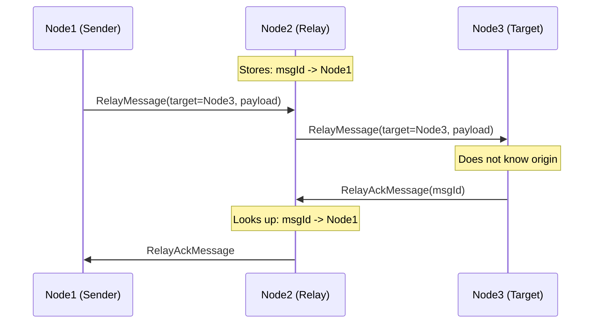
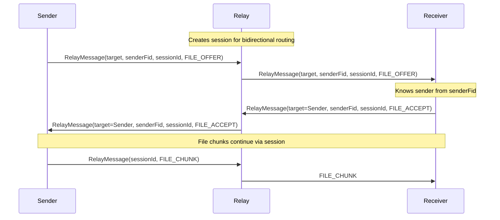
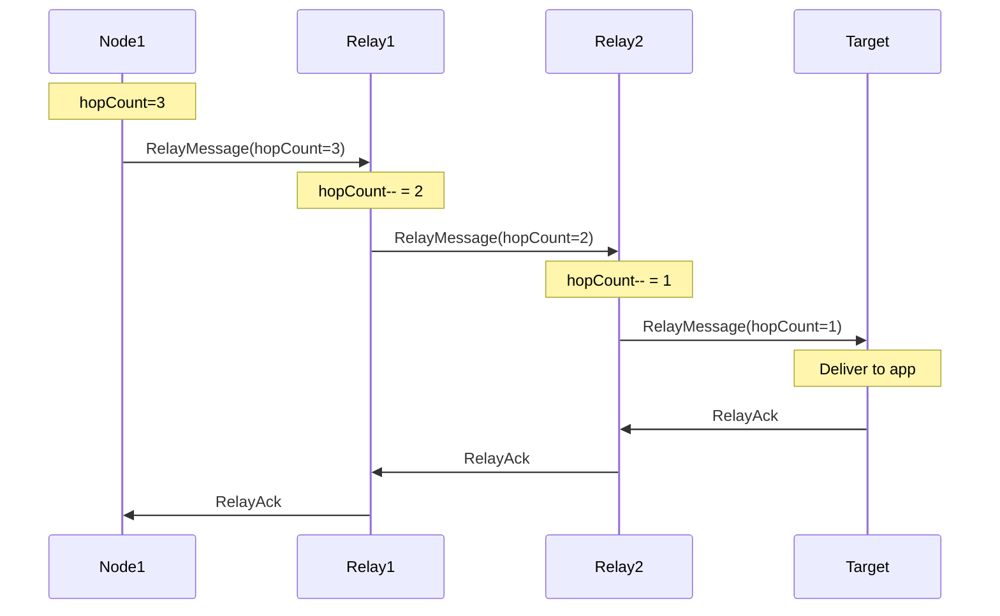

# FUDP Relay and BYTES Message Implementation Plan

**Status**: Implemented  
**Created**: 2025-12-22  
**Updated**: 2025-12-23

## Overview

Add relay functionality where node1 sends messages to node3 via node2. Supports two modes:
1. **Anonymous relay** (privacy-preserving): target does not learn sender identity
2. **Identified relay** (session-based): sender reveals identity for bidirectional protocols like file transfer

Also includes BYTES message type for general-purpose byte array transfer with optional acknowledgment.

## Relay Modes

### Anonymous Relay (Privacy-Preserving)



- Target never learns sender identity
- Good for chat, notifications, anonymous data

### Identified Relay (Session-Based)



- Sender reveals identity (required for responses)
- Session groups related messages (offer, accept, chunks)
- Relay maintains bidirectional routing for 5 minutes
- Good for file transfer, request-response protocols

### Multi-Hop Relay



## Key Design Decisions

### RelayMessage Fields

```java
public class RelayMessage {
    String targetFid;       // Final destination FID
    String senderFid;       // Optional: sender identity (for identified relay)
    long sessionId;         // Optional: groups related messages
    int hopCount;           // Max 5, decremented at each hop
    byte[] innerPayload;    // Encoded inner message (max 64KB)
}
```

### Message Types

| Type | Code | Description |
|------|------|-------------|
| BYTES | 0x60 | General-purpose byte array |
| BYTES_ACK | 0x61 | Bytes delivery confirmed |
| RELAY | 0x40 | Relay message (anonymous or identified) |
| RELAY_ACK | 0x41 | Relay delivery confirmed |
| RELAY_FAIL | 0x42 | Relay delivery failed |

### Relay Error Codes

| Code | Constant | Description |
|------|----------|-------------|
| 1 | ERR_UNKNOWN_TARGET | Target FID not in peerBook |
| 2 | ERR_HOP_LIMIT | Max hops (5) exceeded |
| 3 | ERR_DELIVERY_FAILED | Could not deliver to target |
| 4 | ERR_TIMEOUT | Relay timeout |
| 5 | ERR_PAYLOAD_TOO_LARGE | Payload exceeds 64KB |

### Limits and Configuration

| Setting | Value | Description |
|---------|-------|-------------|
| Max hop count | 5 | Prevents infinite loops |
| Max relay payload | 64KB | Prevents abuse |
| Pending relay TTL | 60 seconds | Cleanup expired entries |
| Session TTL | 5 minutes | For file transfers |

## API Reference

### FudpNode Methods

```java
// Anonymous relay (privacy-preserving)
long sendViaRelay(String relayPeerId, String targetFid, AppMessage innerMessage)

// Identified relay (for bidirectional protocols)
long sendViaRelayIdentified(String relayPeerId, String targetFid, long sessionId, AppMessage innerMessage)

// File relay
long generateRelaySessionId()
long sendFileOfferViaRelay(String relayPeerId, String targetFid, File file)
void acceptRelayedFile(String relayPeerId, String senderFid, long sessionId, String transferId, String saveDir)
void rejectRelayedFile(String relayPeerId, String senderFid, long sessionId, String transferId, String reason)

How File Relay Works
Sender                    Relay                    Receiver
   |                        |                         |
   |--FILE_OFFER----------->|                         |
   |  (senderFid, session)  |--FILE_OFFER------------>|
   |                        |  (senderFid, session)   |
   |                        |                         |
   |                        |<-------FILE_ACCEPT------|
   |<-------FILE_ACCEPT-----|  (via session routing)  |
   |                        |                         |
   |--FILE_CHUNK----------->|--FILE_CHUNK------------>|
   |--FILE_CHUNK----------->|--FILE_CHUNK------------>|
   |--FILE_COMPLETE-------->|--FILE_COMPLETE--------->|

// Bytes
long sendBytes(String peerId, byte[] data)
long sendBytes(String peerId, byte[] data, int dataType)
long sendBytesWithAck(String peerId, byte[] data)

// Statistics
RelayHandler.RelayStats getRelayStats()
```

### NodeEventListener Callbacks

```java
// Bytes events
void onBytesReceived(String peerId, long messageId, int dataType, byte[] data)
void onBytesAck(String peerId, long messageId, long rttMs)

// Anonymous relay events
void onRelayedMessageReceived(String relayPeerId, AppMessage message)

// Identified relay events (for file transfer)
void onRelayedMessageReceived(String relayPeerId, String senderFid, long sessionId, AppMessage message)

// Relay status events
void onRelayAck(long messageId, long rttMs)
void onRelayFailed(long messageId, int errorCode, String reason)
```

## File Summary

| File | Description |
|------|-------------|
| `MessageType.java` | BYTES(0x60), BYTES_ACK(0x61) added |
| `BytesMessage.java` | General bytes with dataType field |
| `BytesAckMessage.java` | ACK for bytes |
| `RelayErrorCode.java` | Error constants |
| `RelayMessage.java` | With optional senderFid, sessionId |
| `RelayAckMessage.java` | Relay ACK |
| `RelayFailMessage.java` | Relay failure with error codes |
| `MessageCodec.java` | 5 new message types |
| `RelayHandler.java` | Routing, sessions, TTL, stats |
| `FileHandler.java` | RelayedTransfer support |
| `FudpNode.java` | Relay and bytes methods |
| `NodeEventListener.java` | 6 new events |
| `StartFudpNode.java` | CLI menus for relay/bytes |

## Implementation Status

| Feature | Status |
|---------|--------|
| BYTES/BYTES_ACK messages | ✅ Complete |
| Anonymous relay | ✅ Complete |
| Identified relay (session-based) | ✅ Complete |
| File relay offer | ✅ Complete |
| File relay accept/reject | ✅ Basic (needs chunk handling) |
| Multi-hop relay | ✅ Complete |
| Relay statistics | ✅ Complete |
| CLI menus | ✅ Complete |

## CLI Usage

### Main Menu

```
1. Start Node
2. Stop Node
3. Node Status
4. Performance Stats
5. Peer Management
6. Send Chat
7. Send Bytes        <- NEW
8. Relay Message     <- NEW
9. File Transfer
10. Ping Peer
11. Send Request
12. Generate New Key
```

### Relay Message Submenu

```
1. Send Chat via Relay    - Anonymous, privacy-preserving
2. Send File via Relay    - Identified, reveals sender
3. Add Peer by FID        - For relay testing
4. Relay Statistics       - View relay stats
```

## Testing Scenarios

### 1. Anonymous Chat Relay

```bash
# Node1 sends chat to Node3 via Node2
# Node3 receives chat but doesn't know it's from Node1

Node1> Relay Message > Send Chat via Relay
  Relay: Node2
  Target: Node3_FID
  Message: Hello via relay

Node3> [RELAYED MESSAGE RECEIVED]
  Via Relay: Node2
  Origin: UNKNOWN (privacy-preserving)
  Content: Hello via relay
```

### 2. File Transfer via Relay

```bash
# Node1 sends file to Node3 via Node2
# Node3 sees sender identity (required for accept/reject)

Node1> Relay Message > Send File via Relay
  Relay: Node2
  Target: Node3_FID
  File: /path/to/file.txt

Node3> [IDENTIFIED RELAYED MESSAGE RECEIVED]
  Via Relay: Node2
  From: Node1_FID
  Session: 123456
  File: file.txt
  Size: 1.5 KB
```

## Future Enhancements

- [ ] RELAY_QUERY / RELAY_QUOTE for relay economics
- [ ] Peer discovery mechanism (DHT, bootstrap nodes)
- [ ] NodeConfig option to disable relay functionality
- [ ] Relay node reputation/trust scoring
- [ ] Full file chunk transfer via relay (currently offer/accept only)
- [ ] Resume interrupted relay file transfers
